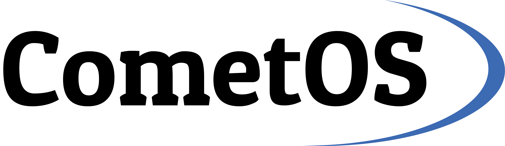

=======

CometOS is an operating system for x86 PCs, written in assembly language and C.

## Features

Currently supported elements:

- grub BootLoader
- Printing text to screen
- C support
- keybord input
- IRQ's
- Paging
- Timer
- Time and date
- VFS

Todo elements:

- User space
- Multitasking
- File system
- Tasking
- System calls
- VGA drivers
- Shell

## Plugins used

- GCC
- G++
- GNU Make
- GNU Bison
- Flex
- GNU GMP
- GNU MPFR
- GNU MPC
- QUEM
- Virtualbox
- GRUB

## Compatibility with computers

At the moment we using grub which is a free open source bootloader. Many operating systems used grub like ubuntu. In the future we plan to have our own custom bootloader.

## How to build/install

First obtain the latest iso image or build from the latest souce code. Note that u will need to setup a crosscompiler to use the following commands.
[Download ISO image](#)

Navagate to the project folder:
```
cd CometOS
```

You can clean the source tree by invoking:
```
./clean.sh
```

You can build a bootable cdrom image of the operating system by invoking:
```
./iso.sh
```

You can run quem emulator quickly by invoking:
```
./qemu.sh
```

If you do not have permition to run the following files use the *chmod +x* command to alow access.
